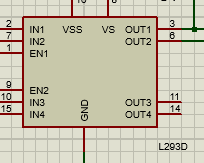

Trabalho referente ao circuito PWM

Aluno.: Lucas Tatin
Professor: Rafael Rodrigues Barbosa

_________________________________________________________________________________

<h1>1. INTRODUÇÃO AO PWM<h1>

É frequentemente utilizado para controlar dispositivos ou sistemas que requerem a variação de potência, como motores, lâmpadas de LED, fontes de alimentação e inversores. A sua versatilidade e eficiência tornam-no uma escolha popular em diversas aplicações.
É uma técnica essencial na eletrônica para controlar a potência entregue a dispositivos e sistemas, através da variação da largura dos pulsos em uma onda quadrada. Sua aplicação abrange uma ampla gama de equipamentos e proporciona controle preciso e eficiente.

_________________________________________________________________________________

<h1>2. COMPONENTES NECESSÁRIOS<h1>

Arduino Nano

L293D (Circuito integrado dedicado ao controle de pequenos motores DC)

Motor (Máquina de Corrente Contínua)

Terminal GND

Osciloscópio

Voltímetro

Resistor(es)

Bateria

Botão

_________________________________________________________________________________

<h1>3. ESQUEMÁTICO<h1>

Segue anexo no schematics do projeto no formato PDF

_________________________________________________________________________________

<h1>4. CÓDIGO FONTE<h1>

 tempo_delay)) {
    pwm += 64;//pwm = pwm + 64
      if(pwm >255){
        pwm = 0;
      }
  }

  analogWrite(PWM, pwm);
  delay(50);
}

_________________________________________________________________________________

<h1>5. INSTRUÇÕES DE MONTAGEM<h1>

Pode ser visto também no anexo no schematics do projeto no formato PDF

_________________________________________________________________________________

<h1>6. FUNCIONAMENTO DO PROJETO<h1>

O sinal de saída do comparador é combinado com a onda portadora após passar pelo filtro. O resultado é uma forma de onda modulada por largura de pulso. A largura dos pulsos é controlada pelo sinal de controle do comparador. Quanto maior a largura do pulso, maior será a potência entregue ao dispositivo ou sistema controlado. Da mesma forma, uma largura de pulso menor resultará em uma potência mais baixa.

O ciclo de trabalho (duty cycle) é uma medida importante no funcionamento do circuito PWM. Ele representa a proporção de tempo em que o sinal está em nível alto (ligado) em relação ao período completo da onda portadora. O ciclo de trabalho é expresso como uma porcentagem, onde 0% significa que o sinal está sempre desligado, e 100% significa que o sinal está sempre ligado.

Ao variar o ciclo de trabalho (alterando a largura dos pulsos), é possível controlar a média de potência entregue ao dispositivo ou sistema. Essa técnica permite um controle preciso e eficiente da potência, possibilitando o ajuste contínuo da velocidade, brilho, tensão ou qualquer outra característica do dispositivo ou sistema controlado pelo circuito PWM.

Em resumo, o circuito PWM utiliza a modulação por largura de pulso para controlar a potência entregue a dispositivos ou sistemas. Ao variar a largura dos pulsos em uma onda portadora, é possível controlar a média de potência de forma precisa e eficiente.

________________________________________________________________________________